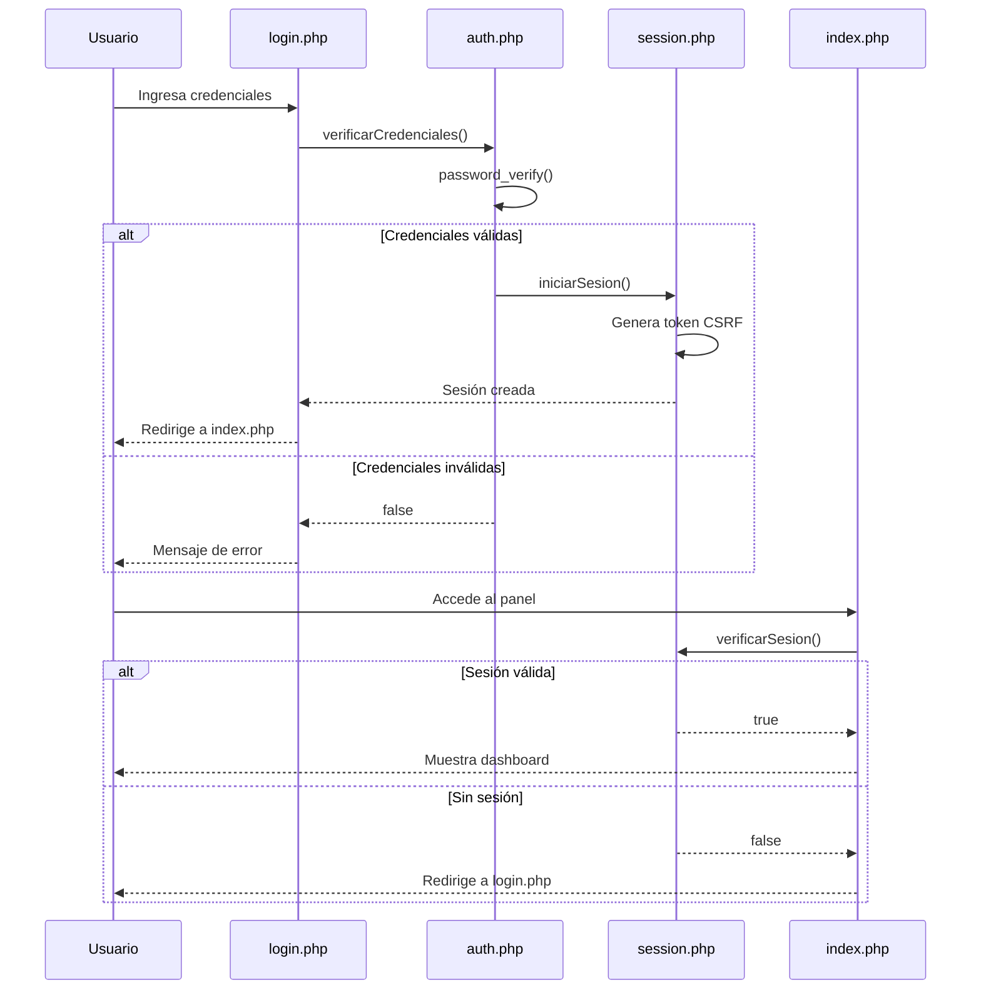
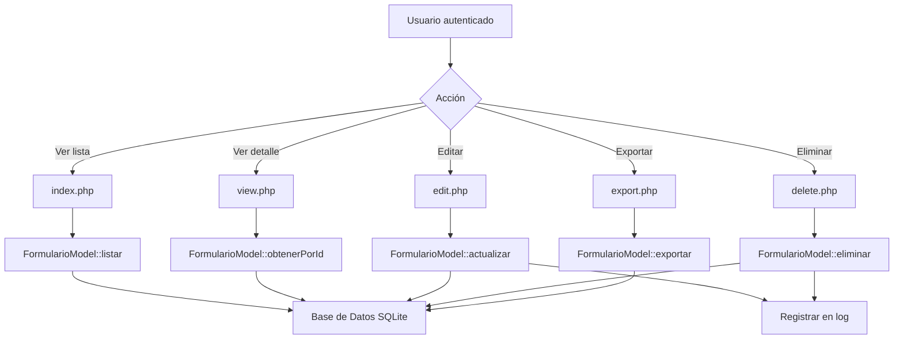

# Documento de Diseño Técnico: Panel de Administración de Base de Datos SQLite

## Overview

El panel de administración es una aplicación web PHP que proporciona una interfaz completa para gestionar los registros de formularios de asesoría almacenados en la base de datos SQLite. El sistema implementa un patrón MVC simplificado con separación clara entre lógica de negocio, acceso a datos y presentación.

El diseño prioriza:
- Seguridad mediante autenticación basada en sesiones PHP y protección contra vulnerabilidades comunes (XSS, CSRF, SQL Injection)
- Usabilidad con interfaz responsiva que mantiene consistencia visual con el formulario principal
- Mantenibilidad mediante código modular y reutilizable
- Rendimiento con paginación de resultados y consultas optimizadas

## Architecture

### Estructura de Directorios

```
/admin/
├── index.php                 # Punto de entrada, dashboard principal
├── login.php                 # Página de autenticación
├── logout.php                # Cierre de sesión
├── view.php                  # Vista detallada de registro
├── edit.php                  # Edición de registro
├── delete.php                # Eliminación de registro
├── export.php                # Exportación a CSV
├── config/
│   └── database.php          # Configuración de conexión a BD
├── includes/
│   ├── auth.php              # Funciones de autenticación
│   ├── session.php           # Gestión de sesiones
│   ├── csrf.php              # Protección CSRF
│   └── functions.php         # Funciones auxiliares
├── models/
│   └── FormularioModel.php   # Modelo de acceso a datos
├── assets/
│   ├── css/
│   │   └── admin.css         # Estilos del panel
│   └── js/
│       └── admin.js          # JavaScript del panel
└── logs/
    └── admin_actions.log     # Registro de acciones
```

### Patrón de Arquitectura

El sistema utiliza un patrón MVC simplificado adaptado a PHP:

- **Modelo (Model)**: `FormularioModel.php` encapsula toda la lógica de acceso a datos usando PDO con prepared statements
- **Vista (View)**: Archivos PHP con HTML que renderizan la interfaz, separando lógica de presentación
- **Controlador (Controller)**: Lógica embebida en cada archivo PHP principal que coordina modelo y vista

### Flujo de Autenticación



### Flujo de Operaciones CRUD



## Components and Interfaces

### 1. Sistema de Autenticación

#### auth.php

```php
/**
 * Verifica las credenciales del usuario
 * @param string $usuario
 * @param string $password
 * @return bool
 */
function verificarCredenciales($usuario, $password): bool

/**
 * Obtiene el hash de contraseña almacenado
 * @param string $usuario
 * @return string|false
 */
function obtenerHashPassword($usuario): string|false

/**
 * Crea un nuevo usuario administrador
 * @param string $usuario
 * @param string $password
 * @return bool
 */
function crearUsuarioAdmin($usuario, $password): bool
```

#### session.php

```php
/**
 * Inicia una sesión segura para el usuario
 * @param string $usuario
 * @return void
 */
function iniciarSesion($usuario): void

/**
 * Verifica si existe una sesión activa válida
 * @return bool
 */
function verificarSesion(): bool

/**
 * Actualiza el timestamp de última actividad
 * @return void
 */
function actualizarActividad(): void

/**
 * Verifica si la sesión ha expirado (30 minutos)
 * @return bool
 */
function sesionExpirada(): bool

/**
 * Cierra la sesión actual
 * @return void
 */
function cerrarSesion(): void
```

#### csrf.php

```php
/**
 * Genera un token CSRF único para la sesión
 * @return string
 */
function generarTokenCSRF(): string

/**
 * Valida el token CSRF recibido
 * @param string $token
 * @return bool
 */
function validarTokenCSRF($token): bool

/**
 * Genera el HTML del campo hidden con token CSRF
 * @return string
 */
function campoTokenCSRF(): string
```

### 2. Modelo de Datos

#### FormularioModel.php

```php
class FormularioModel {
    private PDO $db;
    
    public function __construct(PDO $db)
    
    /**
     * Lista registros con paginación y filtros
     * @param int $pagina
     * @param int $porPagina
     * @param array $filtros ['busqueda' => string, 'fecha_inicio' => string, 'fecha_fin' => string, 'servicio' => string]
     * @return array ['registros' => array, 'total' => int, 'paginas' => int]
     */
    public function listar(int $pagina = 1, int $porPagina = 20, array $filtros = []): array
    
    /**
     * Obtiene un registro por ID
     * @param int $id
     * @return array|null
     */
    public function obtenerPorId(int $id): ?array
    
    /**
     * Actualiza un registro existente
     * @param int $id
     * @param array $datos
     * @return bool
     */
    public function actualizar(int $id, array $datos): bool
    
    /**
     * Elimina un registro
     * @param int $id
     * @return bool
     */
    public function eliminar(int $id): bool
    
    /**
     * Obtiene estadísticas del dashboard
     * @return array ['total' => int, 'mes_actual' => int, 'semana_actual' => int, 'servicios_populares' => array]
     */
    public function obtenerEstadisticas(): array
    
    /**
     * Exporta registros a CSV
     * @param array $filtros
     * @return string Ruta del archivo generado
     */
    public function exportarCSV(array $filtros = []): string
    
    /**
     * Decodifica campos JSON para visualización
     * @param array $registro
     * @return array
     */
    private function decodificarCamposJSON(array $registro): array
}
```

### 3. Funciones Auxiliares

#### functions.php

```php
/**
 * Sanitiza una cadena para prevenir XSS
 * @param string $string
 * @return string
 */
function sanitizar($string): string

/**
 * Formatea una fecha ISO a formato local
 * @param string $fecha
 * @return string
 */
function formatearFecha($fecha): string

/**
 * Decodifica un array JSON a lista legible
 * @param string $json
 * @return string
 */
function jsonALista($json): string

/**
 * Registra una acción en el log
 * @param string $accion
 * @param string $usuario
 * @param array $detalles
 * @return void
 */
function registrarLog($accion, $usuario, $detalles = []): void

/**
 * Genera el HTML de paginación
 * @param int $paginaActual
 * @param int $totalPaginas
 * @param string $urlBase
 * @return string
 */
function generarPaginacion($paginaActual, $totalPaginas, $urlBase): string
```

## Data Models

### Tabla: formularios_asesoria

La tabla ya existe en la base de datos. El panel interactúa con esta estructura:

```sql
CREATE TABLE IF NOT EXISTS formularios_asesoria (
    id INTEGER PRIMARY KEY AUTOINCREMENT,
    fecha_registro TEXT DEFAULT CURRENT_TIMESTAMP,
    dest_identificador TEXT,
    nombre_comercial TEXT,
    ruc TEXT,
    telefono_empresa TEXT,
    direccion_ruc TEXT,
    persona_contacto TEXT,
    cargo_contacto TEXT,
    correo_contacto TEXT,
    telefono_contacto TEXT,
    direccion_oficina TEXT,
    ciudad_oficina TEXT,
    direccion_planta TEXT,
    ciudad_planta TEXT,
    certificaciones TEXT,
    organismo_certificador TEXT,
    alcance_certificacion TEXT,
    servicios_requeridos TEXT,        -- JSON array
    direcciones_establecimiento TEXT,  -- JSON array
    ciudades_establecimiento TEXT,     -- JSON array
    descripcion_negocio TEXT,
    motivo_certificacion TEXT,
    empleados_administrativos INTEGER,
    empleados_operativos INTEGER,
    cantidad_turnos INTEGER,
    personal_por_turno INTEGER,
    horarios_turnos TEXT,
    departamentos_nombre TEXT,         -- JSON array
    departamentos_responsable TEXT,    -- JSON array
    departamentos_personal TEXT        -- JSON array
);
```

### Tabla: usuarios_admin (Nueva)

Se creará una tabla para almacenar credenciales de administradores:

```sql
CREATE TABLE IF NOT EXISTS usuarios_admin (
    id INTEGER PRIMARY KEY AUTOINCREMENT,
    usuario TEXT UNIQUE NOT NULL,
    password_hash TEXT NOT NULL,
    fecha_creacion TEXT DEFAULT CURRENT_TIMESTAMP,
    ultimo_acceso TEXT
);
```

### Estructura de Datos en PHP

```php
// Registro de formulario
$registro = [
    'id' => int,
    'fecha_registro' => string,  // ISO 8601
    'dest_identificador' => string,
    'nombre_comercial' => string,
    'ruc' => string,
    'telefono_empresa' => string,
    'direccion_ruc' => string,
    'persona_contacto' => string,
    'cargo_contacto' => string,
    'correo_contacto' => string,
    'telefono_contacto' => string,
    'direccion_oficina' => string,
    'ciudad_oficina' => string,
    'direccion_planta' => string,
    'ciudad_planta' => string,
    'certificaciones' => string,
    'organismo_certificador' => string,
    'alcance_certificacion' => string,
    'servicios_requeridos' => array,  // Decodificado de JSON
    'direcciones_establecimiento' => array,
    'ciudades_establecimiento' => array,
    'descripcion_negocio' => string,
    'motivo_certificacion' => string,
    'empleados_administrativos' => int,
    'empleados_operativos' => int,
    'cantidad_turnos' => int,
    'personal_por_turno' => int,
    'horarios_turnos' => string,
    'departamentos_nombre' => array,
    'departamentos_responsable' => array,
    'departamentos_personal' => array
];

// Filtros de búsqueda
$filtros = [
    'busqueda' => string,      // Búsqueda en nombre, RUC, contacto
    'fecha_inicio' => string,  // YYYY-MM-DD
    'fecha_fin' => string,     // YYYY-MM-DD
    'servicio' => string       // Nombre del servicio
];

// Estadísticas
$estadisticas = [
    'total' => int,
    'mes_actual' => int,
    'semana_actual' => int,
    'servicios_populares' => [
        ['servicio' => string, 'cantidad' => int],
        // ...
    ]
];
```


## Correctness Properties

*A property is a characteristic or behavior that should hold true across all valid executions of a system-essentially, a formal statement about what the system should do. Properties serve as the bridge between human-readable specifications and machine-verifiable correctness guarantees.*

### Property 1: Autenticación con credenciales válidas crea sesión

*For any* usuario y contraseña válidos, cuando se intenta autenticar, el sistema debe crear una sesión PHP segura con un token CSRF válido.

**Validates: Requirements 1.2**

### Property 2: Autenticación con credenciales inválidas deniega acceso

*For any* combinación de usuario y contraseña que no coincida con credenciales almacenadas, el sistema debe denegar el acceso y no crear ninguna sesión.

**Validates: Requirements 1.3**

### Property 3: Páginas protegidas redirigen sin sesión

*For any* página del panel de administración (excepto login.php), cuando se accede sin una sesión activa válida, el sistema debe redirigir al usuario a la página de login.

**Validates: Requirements 1.4**

### Property 4: Contraseñas almacenadas con hash seguro

*For any* contraseña almacenada en la base de datos, el hash debe ser verificable usando password_verify() de PHP, y no debe ser posible recuperar la contraseña original del hash.

**Validates: Requirements 1.5**

### Property 5: Registros ordenados por fecha descendente

*For any* conjunto de registros en la base de datos, cuando se listan en el panel, deben aparecer ordenados por fecha_registro en orden descendente (más recientes primero).

**Validates: Requirements 2.3**

### Property 6: Paginación con más de 20 registros

*For any* conjunto de registros que contenga más de 20 elementos, el sistema debe mostrar exactamente 20 registros por página y proporcionar navegación entre páginas.

**Validates: Requirements 2.4**

### Property 7: Campos JSON decodificados correctamente

*For any* registro que contenga campos JSON (servicios_requeridos, departamentos_nombre, etc.), el sistema debe decodificarlos y mostrarlos en formato legible sin errores de parsing.

**Validates: Requirements 2.5**

### Property 8: Búsqueda filtra en múltiples campos

*For any* término de búsqueda ingresado, el sistema debe retornar solo registros donde el término aparezca en nombre_comercial, ruc, persona_contacto o correo_contacto (case-insensitive).

**Validates: Requirements 3.2**

### Property 9: Filtro por rango de fechas

*For any* rango de fechas (fecha_inicio, fecha_fin), el sistema debe mostrar solo registros cuya fecha_registro esté dentro de ese rango (inclusive).

**Validates: Requirements 3.4**

### Property 10: Filtro por servicio específico

*For any* servicio seleccionado, el sistema debe mostrar solo registros cuyo campo servicios_requeridos (JSON array) contenga ese servicio.

**Validates: Requirements 3.6**

### Property 11: Todos los campos presentes en vistas y formularios

*For any* registro, tanto la vista detallada como el formulario de edición deben mostrar todos los campos de la base de datos sin omitir ninguno.

**Validates: Requirements 4.1, 5.2**

### Property 12: Arrays JSON formateados estructuradamente

*For any* registro con arrays JSON (establecimientos, departamentos), la vista detallada debe mostrarlos en formato estructurado (lista o tabla) y no como string JSON crudo.

**Validates: Requirements 4.2**

### Property 13: Fechas en formato local

*For any* fecha almacenada en formato ISO 8601, el sistema debe mostrarla en formato local dd/mm/yyyy HH:mm en todas las vistas.

**Validates: Requirements 4.3**

### Property 14: Actualización persiste cambios y confirma

*For any* registro y cualquier modificación válida de sus campos, cuando se guarda la edición, los cambios deben persistir en la base de datos y el sistema debe mostrar un mensaje de confirmación. (Round-trip: leer → modificar → guardar → leer debe reflejar los cambios)

**Validates: Requirements 5.3, 5.5**

### Property 15: Validación de campos requeridos

*For any* intento de guardar un registro donde nombre_comercial, ruc o correo_contacto estén vacíos, el sistema debe rechazar la operación y mostrar un mensaje de error sin modificar la base de datos.

**Validates: Requirements 5.4**

### Property 16: Eliminación exitosa remueve registro y confirma

*For any* registro existente, cuando se confirma su eliminación, el registro debe ser removido de la base de datos (no debe ser recuperable por ID) y el sistema debe mostrar un mensaje de confirmación.

**Validates: Requirements 6.3, 6.4**

### Property 17: Exportación CSV respeta filtros activos

*For any* conjunto de filtros aplicados (búsqueda, fechas, servicio), el archivo CSV exportado debe contener exactamente los mismos registros visibles en la lista filtrada.

**Validates: Requirements 7.2**

### Property 18: CSV contiene todas las columnas con JSON convertido

*For any* exportación CSV, el archivo debe incluir todas las columnas de la tabla formularios_asesoria, y los campos JSON deben estar convertidos a formato de texto legible (no como JSON crudo).

**Validates: Requirements 7.3, 7.4**

### Property 19: Nombre de archivo CSV con formato correcto

*For any* exportación CSV, el nombre del archivo debe seguir el patrón formularios_asesoria_YYYYMMDD_HHMMSS.csv donde la fecha y hora corresponden al momento de la exportación.

**Validates: Requirements 7.6**

### Property 20: Estadísticas de conteo correctas

*For any* estado de la base de datos, las estadísticas deben mostrar: (1) el total correcto de registros, (2) el conteo correcto de registros del mes actual, y (3) el conteo correcto de registros de la semana actual.

**Validates: Requirements 8.2, 8.3, 8.4**

### Property 21: Servicios más solicitados calculados correctamente

*For any* conjunto de registros, la lista de servicios más solicitados debe mostrar cada servicio con su conteo correcto, ordenados de mayor a menor frecuencia.

**Validates: Requirements 8.5**

### Property 22: Protección CSRF en formularios de modificación

*For any* formulario que modifique datos (edición, eliminación), el sistema debe rechazar la solicitud si no incluye un token CSRF válido.

**Validates: Requirements 9.1**

### Property 23: Sanitización previene XSS

*For any* entrada de usuario que contenga caracteres especiales HTML (<, >, &, ", '), el sistema debe sanitizarla antes de mostrarla, convirtiendo los caracteres a entidades HTML.

**Validates: Requirements 9.2**

### Property 24: Logging de acciones de modificación

*For any* acción de modificación (edición o eliminación), el sistema debe registrar en el archivo de log: timestamp, usuario, tipo de acción, y ID del registro afectado.

**Validates: Requirements 9.4**

### Property 25: Expiración de sesión por inactividad

*For any* sesión activa, si transcurren 30 minutos sin actividad (sin requests al servidor), el sistema debe invalidar la sesión y requerir nueva autenticación.

**Validates: Requirements 9.5**

## Error Handling

### Estrategia General

El sistema implementa manejo de errores en múltiples capas:

1. **Capa de Validación**: Validación de entrada antes de procesamiento
2. **Capa de Base de Datos**: Manejo de excepciones PDO
3. **Capa de Presentación**: Mensajes de error amigables al usuario
4. **Capa de Logging**: Registro de errores para debugging

### Tipos de Errores y Manejo

#### Errores de Autenticación

```php
// Credenciales inválidas
if (!verificarCredenciales($usuario, $password)) {
    $_SESSION['error'] = 'Usuario o contraseña incorrectos';
    header('Location: login.php');
    exit();
}

// Sesión expirada
if (sesionExpirada()) {
    cerrarSesion();
    $_SESSION['error'] = 'Su sesión ha expirado. Por favor, inicie sesión nuevamente.';
    header('Location: login.php');
    exit();
}

// Token CSRF inválido
if (!validarTokenCSRF($_POST['csrf_token'])) {
    http_response_code(403);
    die('Token de seguridad inválido. Por favor, recargue la página e intente nuevamente.');
}
```

#### Errores de Base de Datos

```php
try {
    $modelo->actualizar($id, $datos);
    $_SESSION['success'] = 'Registro actualizado exitosamente';
} catch (PDOException $e) {
    error_log("Error BD: " . $e->getMessage());
    $_SESSION['error'] = 'Error al actualizar el registro. Por favor, intente nuevamente.';
    // No exponer detalles técnicos al usuario
}
```

#### Errores de Validación

```php
// Campos requeridos vacíos
$errores = [];
if (empty($datos['nombre_comercial'])) {
    $errores[] = 'El nombre comercial es requerido';
}
if (empty($datos['ruc'])) {
    $errores[] = 'El RUC es requerido';
}
if (!filter_var($datos['correo_contacto'], FILTER_VALIDATE_EMAIL)) {
    $errores[] = 'El correo electrónico no es válido';
}

if (!empty($errores)) {
    $_SESSION['errores'] = $errores;
    header('Location: edit.php?id=' . $id);
    exit();
}
```

#### Errores de Recursos No Encontrados

```php
// Registro no existe
$registro = $modelo->obtenerPorId($id);
if ($registro === null) {
    http_response_code(404);
    $_SESSION['error'] = 'El registro solicitado no existe';
    header('Location: index.php');
    exit();
}
```

#### Errores de Exportación

```php
try {
    $archivoCSV = $modelo->exportarCSV($filtros);
    if (!file_exists($archivoCSV)) {
        throw new Exception('No se pudo generar el archivo CSV');
    }
    // Enviar archivo...
} catch (Exception $e) {
    error_log("Error exportación: " . $e->getMessage());
    $_SESSION['error'] = 'Error al exportar los datos. Por favor, intente nuevamente.';
    header('Location: index.php');
    exit();
}
```

### Logging de Errores

Todos los errores se registran en dos lugares:

1. **Error Log de PHP**: Errores técnicos y excepciones
   ```php
   error_log("Error en {$archivo}: {$mensaje}");
   ```

2. **Log de Acciones**: Acciones de usuario y errores de negocio
   ```php
   registrarLog('error', $_SESSION['usuario'], [
       'accion' => 'eliminar_registro',
       'registro_id' => $id,
       'error' => $mensaje
   ]);
   ```

### Mensajes de Error al Usuario

Los mensajes siguen estos principios:
- **Claros y específicos**: Indican qué salió mal
- **Accionables**: Sugieren cómo resolver el problema
- **Seguros**: No exponen detalles técnicos o de seguridad
- **Consistentes**: Mismo tono y formato en todo el sistema

Ejemplos:
- ✅ "El RUC es requerido"
- ✅ "Error al actualizar el registro. Por favor, intente nuevamente."
- ❌ "PDOException: SQLSTATE[23000]: Integrity constraint violation"

## Testing Strategy

### Enfoque Dual de Testing

El sistema requiere dos tipos complementarios de pruebas:

1. **Unit Tests**: Verifican ejemplos específicos, casos edge y condiciones de error
2. **Property-Based Tests**: Verifican propiedades universales a través de múltiples inputs generados

### Unit Testing

Los unit tests se enfocan en:

- **Ejemplos específicos**: Casos de uso concretos y flujos principales
- **Casos edge**: Límites, valores especiales, condiciones extremas
- **Integración**: Puntos de conexión entre componentes
- **Manejo de errores**: Comportamiento ante fallos

#### Herramientas

- **PHPUnit**: Framework de testing para PHP
- **SQLite en memoria**: Base de datos temporal para tests

#### Estructura de Tests

```
/tests/
├── Unit/
│   ├── AuthTest.php              # Tests de autenticación
│   ├── SessionTest.php           # Tests de sesiones
│   ├── CSRFTest.php              # Tests de protección CSRF
│   ├── FormularioModelTest.php   # Tests del modelo
│   └── FunctionsTest.php         # Tests de funciones auxiliares
├── Integration/
│   ├── LoginFlowTest.php         # Flujo completo de login
│   ├── CRUDFlowTest.php          # Flujos CRUD completos
│   └── ExportFlowTest.php        # Flujo de exportación
└── bootstrap.php                 # Configuración de tests
```

#### Ejemplos de Unit Tests

```php
// tests/Unit/AuthTest.php
class AuthTest extends TestCase {
    public function testCredencialesValidasRetornaTrue() {
        // Ejemplo específico: usuario conocido con password correcto
        $resultado = verificarCredenciales('admin', 'password123');
        $this->assertTrue($resultado);
    }
    
    public function testCredencialesInvalidasRetornaFalse() {
        // Ejemplo específico: password incorrecto
        $resultado = verificarCredenciales('admin', 'wrongpassword');
        $this->assertFalse($resultado);
    }
    
    public function testUsuarioInexistenteRetornaFalse() {
        // Caso edge: usuario que no existe
        $resultado = verificarCredenciales('noexiste', 'password');
        $this->assertFalse($resultado);
    }
}

// tests/Unit/FormularioModelTest.php
class FormularioModelTest extends TestCase {
    public function testListarConCeroRegistrosRetornaArrayVacio() {
        // Caso edge: base de datos vacía
        $modelo = new FormularioModel($this->db);
        $resultado = $modelo->listar();
        $this->assertEmpty($resultado['registros']);
        $this->assertEquals(0, $resultado['total']);
    }
    
    public function testEliminarRegistroInexistenteRetornaFalse() {
        // Caso edge: intentar eliminar ID que no existe
        $modelo = new FormularioModel($this->db);
        $resultado = $modelo->eliminar(99999);
        $this->assertFalse($resultado);
    }
}
```

### Property-Based Testing

Los property tests verifican propiedades universales usando generación aleatoria de datos.

#### Herramientas

- **Eris**: Librería de property-based testing para PHP (port de QuickCheck)
- Instalación: `composer require --dev giorgiosironi/eris`

#### Configuración

Cada property test debe:
- Ejecutar mínimo 100 iteraciones (debido a randomización)
- Incluir tag con referencia a la propiedad del diseño
- Usar generadores apropiados para los tipos de datos

#### Ejemplos de Property Tests

```php
// tests/Property/AuthPropertiesTest.php
use Eris\Generator;

class AuthPropertiesTest extends TestCase {
    use Eris\TestTrait;
    
    /**
     * Feature: admin-database-viewer, Property 2: Autenticación con credenciales inválidas deniega acceso
     * @test
     */
    public function credencialesInvalidasNuncaCreanSesion() {
        $this->forAll(
            Generator\string(),  // usuario aleatorio
            Generator\string()   // password aleatorio
        )->then(function($usuario, $password) {
            // Asegurar que no son credenciales válidas
            $this->assume(!$this->esCredencialValida($usuario, $password));
            
            // Intentar autenticar
            $resultado = verificarCredenciales($usuario, $password);
            
            // Debe fallar
            $this->assertFalse($resultado);
            $this->assertArrayNotHasKey('usuario', $_SESSION);
        });
    }
    
    /**
     * Feature: admin-database-viewer, Property 4: Contraseñas almacenadas con hash seguro
     * @test
     */
    public function passwordsHasheadosSonVerificables() {
        $this->forAll(
            Generator\string()  // password aleatorio
        )->then(function($password) {
            // Hashear password
            $hash = password_hash($password, PASSWORD_DEFAULT);
            
            // Debe ser verificable
            $this->assertTrue(password_verify($password, $hash));
            
            // Hash no debe contener password original
            $this->assertStringNotContainsString($password, $hash);
        });
    }
}

// tests/Property/FormularioPropertiesTest.php
class FormularioPropertiesTest extends TestCase {
    use Eris\TestTrait;
    
    /**
     * Feature: admin-database-viewer, Property 5: Registros ordenados por fecha descendente
     * @test
     */
    public function registrosSiempreOrdenadosPorFechaDescendente() {
        $this->forAll(
            Generator\seq(Generator\associative([
                'nombre_comercial' => Generator\string(),
                'ruc' => Generator\string(),
                'fecha_registro' => $this->generadorFechas()
            ]))
        )->then(function($registros) {
            // Insertar registros en orden aleatorio
            foreach ($registros as $registro) {
                $this->modelo->insertar($registro);
            }
            
            // Listar registros
            $resultado = $this->modelo->listar();
            $fechas = array_column($resultado['registros'], 'fecha_registro');
            
            // Verificar orden descendente
            $fechasOrdenadas = $fechas;
            rsort($fechasOrdenadas);
            $this->assertEquals($fechasOrdenadas, $fechas);
        });
    }
    
    /**
     * Feature: admin-database-viewer, Property 14: Actualización persiste cambios y confirma
     * @test
     */
    public function actualizacionRoundTripPreservaDatos() {
        $this->forAll(
            $this->generadorRegistro(),
            $this->generadorCambios()
        )->then(function($registroOriginal, $cambios) {
            // Insertar registro original
            $id = $this->modelo->insertar($registroOriginal);
            
            // Actualizar con cambios
            $this->modelo->actualizar($id, $cambios);
            
            // Leer de nuevo
            $registroActualizado = $this->modelo->obtenerPorId($id);
            
            // Verificar que los cambios se aplicaron
            foreach ($cambios as $campo => $valor) {
                $this->assertEquals($valor, $registroActualizado[$campo]);
            }
        });
    }
    
    /**
     * Feature: admin-database-viewer, Property 8: Búsqueda filtra en múltiples campos
     * @test
     */
    public function busquedaRetornaSoloCoincidencias() {
        $this->forAll(
            Generator\seq($this->generadorRegistro()),
            Generator\string()
        )->then(function($registros, $termino) {
            // Insertar registros
            foreach ($registros as $registro) {
                $this->modelo->insertar($registro);
            }
            
            // Buscar
            $resultado = $this->modelo->listar(1, 20, ['busqueda' => $termino]);
            
            // Verificar que todos los resultados contienen el término
            foreach ($resultado['registros'] as $registro) {
                $encontrado = 
                    stripos($registro['nombre_comercial'], $termino) !== false ||
                    stripos($registro['ruc'], $termino) !== false ||
                    stripos($registro['persona_contacto'], $termino) !== false ||
                    stripos($registro['correo_contacto'], $termino) !== false;
                
                $this->assertTrue($encontrado);
            }
        });
    }
    
    /**
     * Feature: admin-database-viewer, Property 15: Validación de campos requeridos
     * @test
     */
    public function camposRequeridosVaciosRechazanActualizacion() {
        $this->forAll(
            $this->generadorRegistro(),
            Generator\elements(['nombre_comercial', 'ruc', 'correo_contacto'])
        )->then(function($registro, $campoVacio) {
            // Insertar registro válido
            $id = $this->modelo->insertar($registro);
            
            // Intentar actualizar dejando un campo requerido vacío
            $cambios = [$campoVacio => ''];
            $resultado = $this->modelo->actualizar($id, $cambios);
            
            // Debe rechazar la actualización
            $this->assertFalse($resultado);
            
            // Verificar que el registro no cambió
            $registroActual = $this->modelo->obtenerPorId($id);
            $this->assertEquals($registro[$campoVacio], $registroActual[$campoVacio]);
        });
    }
    
    // Generadores personalizados
    private function generadorFechas() {
        return Generator\map(
            function($timestamp) {
                return date('Y-m-d H:i:s', $timestamp);
            },
            Generator\choose(
                strtotime('2020-01-01'),
                strtotime('2025-12-31')
            )
        );
    }
    
    private function generadorRegistro() {
        return Generator\associative([
            'nombre_comercial' => Generator\string(),
            'ruc' => Generator\string(),
            'correo_contacto' => Generator\email(),
            'persona_contacto' => Generator\string(),
            'servicios_requeridos' => Generator\seq(
                Generator\elements(['ISO 9001', 'BPM', 'ISO 45001', 'HACCP'])
            )
            // ... más campos
        ]);
    }
    
    private function generadorCambios() {
        return Generator\associative([
            'nombre_comercial' => Generator\string(),
            'telefono_empresa' => Generator\string()
        ]);
    }
}

// tests/Property/SecurityPropertiesTest.php
class SecurityPropertiesTest extends TestCase {
    use Eris\TestTrait;
    
    /**
     * Feature: admin-database-viewer, Property 23: Sanitización previene XSS
     * @test
     */
    public function sanitizacionConvierteCaracteresEspeciales() {
        $this->forAll(
            Generator\string()
        )->then(function($entrada) {
            $sanitizado = sanitizar($entrada);
            
            // No debe contener caracteres peligrosos sin escapar
            $this->assertStringNotContainsString('<script>', $sanitizado);
            $this->assertStringNotContainsString('javascript:', $sanitizado);
            
            // Caracteres especiales deben estar como entidades HTML
            if (strpos($entrada, '<') !== false) {
                $this->assertStringContainsString('&lt;', $sanitizado);
            }
            if (strpos($entrada, '>') !== false) {
                $this->assertStringContainsString('&gt;', $sanitizado);
            }
        });
    }
    
    /**
     * Feature: admin-database-viewer, Property 22: Protección CSRF en formularios de modificación
     * @test
     */
    public function formulariosSinTokenCSRFSonRechazados() {
        $this->forAll(
            $this->generadorRegistro(),
            Generator\string()  // token inválido aleatorio
        )->then(function($cambios, $tokenInvalido) {
            // Asegurar que no es un token válido
            $this->assume(!validarTokenCSRF($tokenInvalido));
            
            // Intentar actualizar con token inválido
            $_POST['csrf_token'] = $tokenInvalido;
            $_POST = array_merge($_POST, $cambios);
            
            // Debe rechazar la operación
            ob_start();
            include 'admin/edit.php';
            $output = ob_get_clean();
            
            $this->assertStringContainsString('Token de seguridad inválido', $output);
        });
    }
}
```

### Cobertura de Testing

Objetivo de cobertura:
- **Funciones críticas de seguridad**: 100% (auth, session, csrf)
- **Modelo de datos**: 90%
- **Controladores**: 80%
- **Funciones auxiliares**: 85%

### Ejecución de Tests

```bash
# Ejecutar todos los tests
./vendor/bin/phpunit

# Ejecutar solo unit tests
./vendor/bin/phpunit tests/Unit

# Ejecutar solo property tests
./vendor/bin/phpunit tests/Property

# Ejecutar con reporte de cobertura
./vendor/bin/phpunit --coverage-html coverage/
```

### Integración Continua

Los tests deben ejecutarse automáticamente:
- En cada commit (pre-commit hook)
- En cada pull request
- Antes de cada deploy a producción

